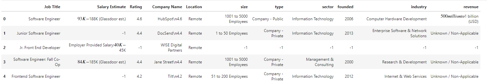

# Glassdoor Scraper for Job

Glassdoor is built for foundation of increasing workplace transparency, Glassdoor offers insights into the employee experience powered by millions of company ratings and reviews, CEO approval ratings, salary reports, interview reviews and questions, benefits reviews, office photos and more, combined with the latest jobs.

## About scrapper

For this project we used library python called [Selenium](https://selenium-python.readthedocs.io/)

## What you get in this project

1. Job Title
2. Salary Estimate
3. Rating
4. Company Name
5. Location
6. Size
7. Type
8. Sector
9. Founded
10. Industry
11. revenue



## How To use it

1. Clone this repo
2. Make new python file
3. Call glassdoor_scraper function

```python
import glassdoor_scrape as gs
link = "https://www.glassdoor.com/Job/software-engineer-jobs-SRCH_KO0,17.htm?context=Jobs&clickSource=searchBox" # input link of job and place you want
df = gs.get_jobs(link, 100) #put the number as you need
```

4. Happy exploring data
